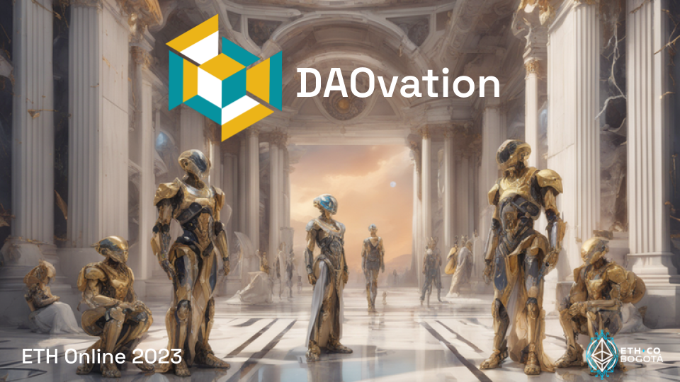

#  DAOvation

## Transforming Governance with Active Participation

* ### Fostering interactions between DAOs and members through community events
* ### Reshape decision-making dynamics, emphasizing the value of active community participation

## How it works

### For DAOs

* DAOs create their profiles via Aragon or Tally
* A form uploads the data to Tableland
* They can host events for its members and external participants
* Users stake a nominal amount of ETH/MATIC to encourage attendance 

### For Members

* Log in to **DAOvation** through an EOA or Polygon ID
* Empowering Governance with Dynamic NFTs
* Granting voting power proportionate to their active participation
* Ensuring Privacy with Polygon ID and ZKPs

